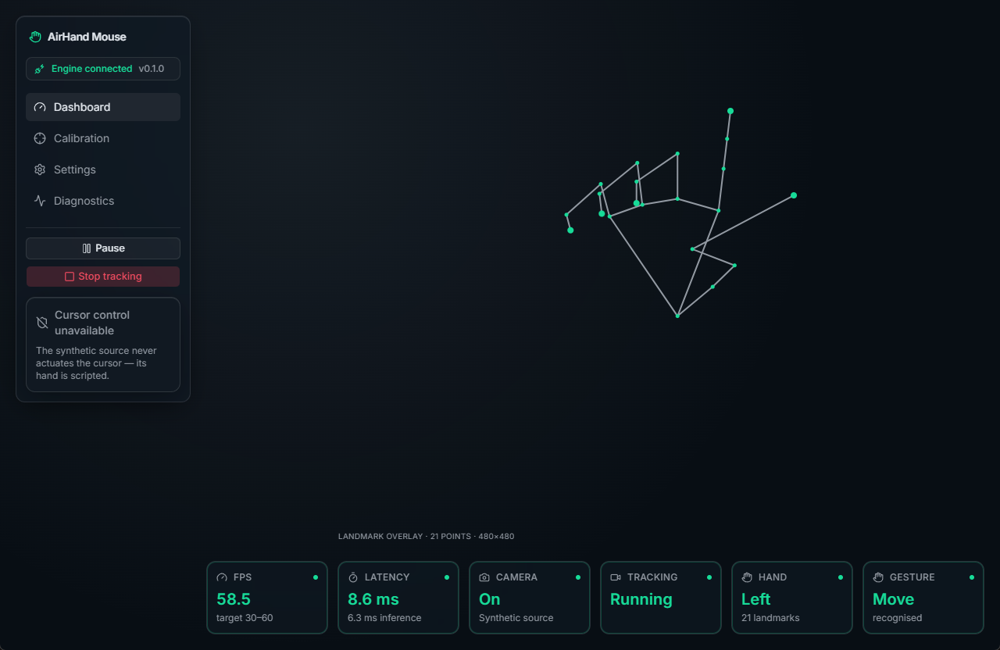
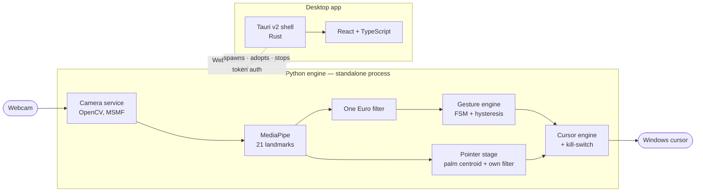
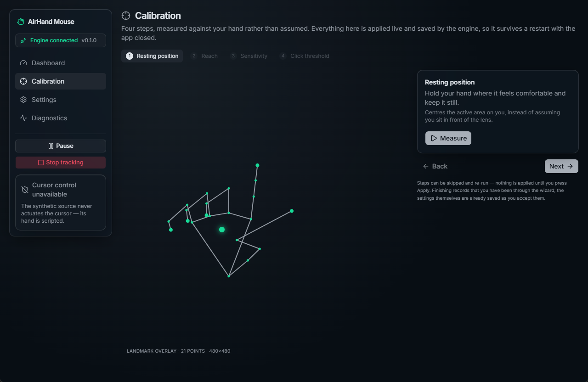
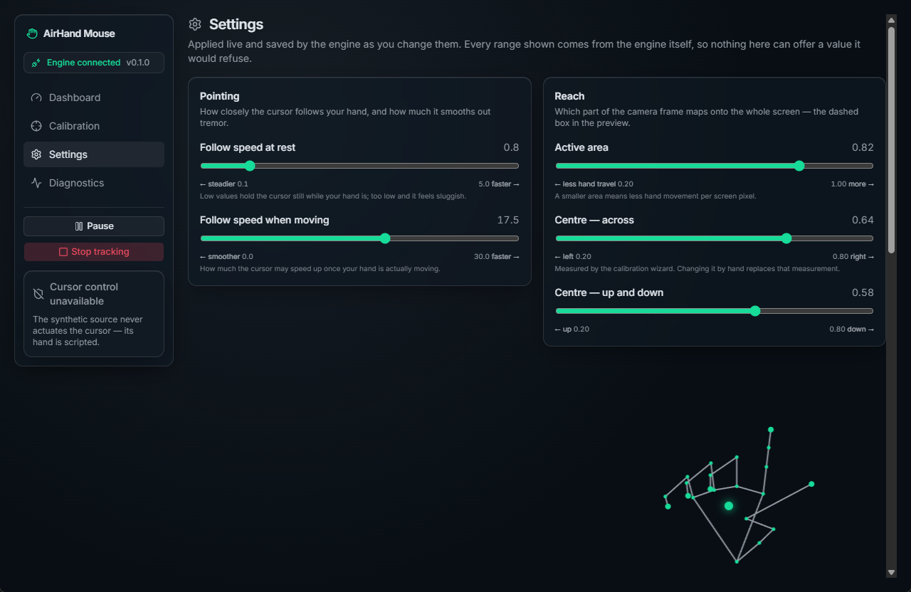
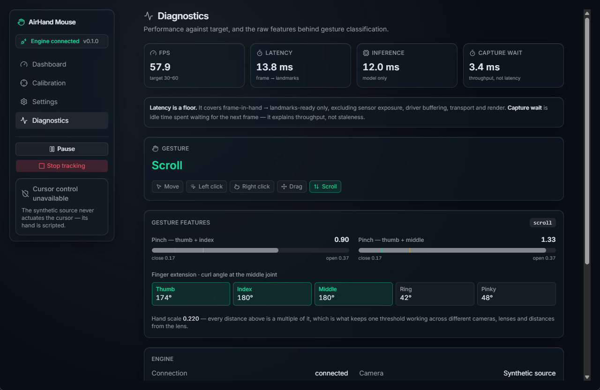

# AirHand Mouse

**Control the Windows cursor with one hand and an ordinary webcam.** Move, left click, right click,
drag and scroll — no cloud, no API keys, no network calls of any kind.

[](#download)
[](LICENSE)
[](https://github.com/niegusss/AirHand/releases/latest)
[](https://github.com/niegusss/AirHand/actions/workflows/release.yml)
[](shared/protocol/README.md)



A Python computer-vision engine does all the seeing and all the clicking. A React interface,
wrapped in a Tauri v2 shell, does all the configuring and all the explaining. They talk over a
WebSocket bound to `127.0.0.1`, and either half runs without the other.

---

## Download

**[Download the latest installer](https://github.com/niegusss/AirHand/releases/latest)** — a single
`.exe`, about 80 MB. It carries the frozen Python engine with it, so **the machine needs no Python
installation**.

| Requirement | Note |
|---|---|
| Windows 10 or newer | 64-bit |
| A webcam | Any. Thresholds are expressed in multiples of hand scale, so they hold across lenses and distances |
| WebView2 | Ships with Windows 11; on Windows 10 it usually arrived through Windows Update. The installer fetches it if it is missing |

Installation is **per-user** — it lands in `%LOCALAPPDATA%\AirHand Mouse` and never asks for
administrator rights.

> **SmartScreen will warn you.** The installer is not code-signed — a certificate is a purchase,
> not a setting. Choose *More info → Run anyway*. Everything about the app is unaffected once past
> the warning.

First launch walks through a short calibration wizard, because the defaults are one person's hand
on one camera and yours is neither.

## Gestures

| Gesture | How | What it does |
|---|---|---|
| **Move** | Index finger extended | The cursor follows the centre of your palm |
| **Left click** | Pinch thumb + index, release | Click |
| **Right click** | Pinch thumb + middle, release | Context menu |
| **Drag** | Pinch thumb + index and hold (0.4 s), release to drop | Press, move, release |
| **Scroll** | Index and middle extended, ring and pinky curled — then move the hand up or down | One step per 0.25 of hand scale travelled |

Two ideas do most of the work. A pinch **closes at one threshold and opens at a larger one**, so a
hand hovering near the boundary does not emit a burst of clicks. And every duration is **in
seconds, never in frames** — a frame-counted hold would mean two different gestures on a 30 fps and
a 60 fps camera.

## Safety

The governing constraint of this project: **you cannot click a "stop" button with a cursor that is
misbehaving.** Everything below follows from it, and each rule has a test.

| Mechanism | Behaviour |
|---|---|
| Global kill-switch | `Ctrl+Alt+Space` disables cursor control instantly, regardless of window focus |
| No hotkey, no actuation | If the hotkey cannot be registered, the engine refuses to offer cursor control at all rather than arming it with no way out |
| Opt-in per session | Cursor control is **off at every launch** and is never restored automatically. Tracking auto-starts; driving the mouse does not |
| Dead-man switch | The last client disconnecting disarms actuation — the intent came from the UI, so it leaves with it |
| Hand lost releases the button | A drag must never outlive the hand that started it. A stuck left button is the worst thing this program could do |
| Clamped coordinates | A bad value cannot throw the pointer off-screen |
| Dry run | `--cursor-dry-run` exercises the entire actuation path with every action logged instead of performed |

One platform fact worth knowing: on Windows a non-elevated process cannot inject input into windows
running as administrator. A click that "does nothing" over an elevated app is UIPI, not a bug.

## Architecture



Three things about this shape are deliberate:

- **The frontend contains no computer-vision logic.** Every landmark, threshold and filter lives in
  Python. The UI is a consumer of a documented wire contract, and the engine keeps working when the
  app is closed.
- **Discovery goes through a handshake file.** The engine binds an ephemeral port, mints a
  per-launch token, and writes `%LOCALAPPDATA%\AirHand\runtime.json` atomically. The shell reads it
  and **verifies the pid is alive** before trusting it, because a hard kill leaves the file behind
  and there is no cleanup opportunity to fix that at the writer.
- **The protocol version exists once**, in [`shared/protocol/protocol.json`](shared/protocol/README.md).
  Vite injects it into TypeScript at build time; Python reads the same file at runtime. There is no
  third copy to drift.

## Measured, not guessed

Dev machine, Thronmax Stream Go Pro webcam, MediaPipe `lite`, CPU only.

| | Target | Measured |
|---|---|---|
| Processing latency | < 50 ms | **9.0 ms** at 640×480 — frame-in-hand → landmarks-ready. A floor, not the end-to-end number |
| Throughput | 30–60 FPS | **30 FPS** — the camera's ceiling, not the model's. Inference alone would allow ~110 |
| Startup, installed app | < 3 s | **3.14 s** cold, **2.84 s** warm, from click to a live authenticated connection |
| Engine startup | — | 1.31 s from app launch; 0.29 s from closing the window to the engine being gone |
| Camera preview | free | 30.4 fps / 11.5 ms with it off **and** on; ~5.7 KB per frame |
| Cursor jitter / lag | — | 1.3 px RMS at rest, 10.2 px trailing mid-sweep, on 2560×1080 |
| Installer | — | 80.4 MB, 12.6 s to install |

The camera is the bottleneck, not MediaPipe. That was worth finding out before optimising anything:
requesting `CAP_PROP_FPS` explicitly is what lifted this webcam from 16–20 FPS to 30, and choosing
MSMF over DirectShow is what keeps 1280×720 from collapsing to 8.9 FPS on USB bandwidth.

## Decisions worth reading

**One-directory freeze, not one-file.** Both were built and timed: 1.1 s versus 3.3 s to publish a
handshake, 266 MB versus 108 MB. Speed was not the deciding argument — process shape was. A
one-file build runs the real process as a *child* of a bootloader, so killing what you launched
leaves the engine alive. A stop that does not stop a program holding a camera and driving the
cursor is a defect, not a trade-off.

**The shell adopts a running engine instead of starting its own.** Two engines fight over the
camera, and the second one's handshake overwrites the first's. So the app spawns only when nothing
live is there, and on exit it stops only what it started — which is also what keeps the
two-terminal development loop working.

**The installer nearly ate the calibration profile.** NSIS installs per-user into
`$LOCALAPPDATA\<productName>`, and `productName` was `AirHand` — the exact directory the engine
keeps `profile.json` in. The uninstaller would have deleted a calibration that only exists because
someone waved a hand at a camera, and that nothing else can reconstruct. The product is now
`AirHand Mouse`; moving the engine's data directory was never an option, since that invalidates
every profile already written.

**Two smoothing filters run in parallel on the same landmarks, never in series.** The overlay and
the gesture engine want *low* lag — a late pinch is a late click. Pointing wants the opposite: the
mapping multiplies normalized coordinates by roughly 2700 px, so noise that is invisible in the
overlay is several pixels of tremor on screen. Chaining the two would add their lag together for no
benefit.

**Calibration keys on the worst pinch, not the best one.** Nothing in it is a min, a max or a mean:
detection drops frames, an occluded thumb throws one wild reading, and a hand told to hold still
drifts. Every derivation is a median or a percentile, and the click threshold is set from the
*worst* of several attempts — a threshold tuned to your cleanest pinch misses all the others.

## Screens

| | |
|---|---|
|  |  |
| **Calibration** — four steps measured against your hand. Every suggestion is an ordinary settings patch, so accepting one takes the same validated path as moving a slider. | **Settings** — fifteen engine knobs, grouped by what you want to change. Every range shown comes from the engine, so the UI cannot offer a value the engine would refuse. |



**Diagnostics** — FPS, latency, inference and capture wait, plus the raw features behind every
classification: both pinch distances against their thresholds, per-finger curl, and the hand scale
that makes those numbers camera-independent.

*Screenshots are taken against the engine's synthetic source, which poses a hand and classifies it
with the real gesture engine. It produces no camera frames, which is why the background is empty
here and shows your blurred camera feed in normal use.*

## Development

Two halves, two terminals. Windows PowerShell — chain with `;`, not `&&`.

```powershell
# Terminal 1 — the engine
cd backend
python -m venv .venv; .\.venv\Scripts\pip.exe install -r requirements-dev.txt
.\.venv\Scripts\python.exe -m airhand.main

# Terminal 2 — the desktop app
cd apps\desktop
npm install
npm run tauri dev
```

The shell finds the engine through the handshake file and adopts it. No webcam at hand? Add
`--source synthetic` and the UI gets a scripted hand instead. For browser-only iteration
(`npm run dev`) the port and token have to be pinned on both sides — a browser cannot read the
handshake file — see [`apps/desktop/README.md`](apps/desktop/README.md).

### Checks

```powershell
cd backend;            .\.venv\Scripts\python.exe -m pytest       # 219 tests, no webcam required
cd apps\desktop;       npx tsc --noEmit -p tsconfig.app.json
                       npm run lint                               # oxlint, not eslint
                       npm run test                               # 56 tests
                       npm run build
cd src-tauri;          cargo test                                 # 11 tests
```

286 tests in total. They cover the wire contract, the handshake, gesture classification, cursor
mapping and every actuation safety rule, the settings channel, calibration derivation and the
preview stream. Detection *quality* is not among them — that needs a real hand in front of a real
camera.

### Building the installer

```powershell
cd backend;      .\.venv\Scripts\pyinstaller.exe airhand.spec   # -> dist\airhand-engine\
cd apps\desktop; npm run engine:sync                            # copy it where Tauri expects it
                 npm run tauri build                            # -> ...\bundle\nsis\*-setup.exe
```

Or push a `v*` tag and let [the workflow](.github/workflows/release.yml) build it on a clean
Windows runner and attach it to a release.

### Layout

```text
apps/desktop/          React + TypeScript UI
  src/                 pages, components, stores, wire client
  src-tauri/           Rust shell: window, handshake reader, engine lifecycle
backend/               the Python engine — runs standalone
  airhand/             camera, tracking, filters, gestures, pointer, cursor, server
  tests/               219 tests
  tools/               benchmarks: camera, gestures, pointer, pinch
shared/protocol/       the wire contract, and the single source of the version number
models/                hand_landmarker.task (MediaPipe, float16)
```

[`backend/README.md`](backend/README.md) is the deeper read: the safety model, the pointing stage,
how calibration derives its numbers, and the traps this PyInstaller build already hit.

## Limitations

Stated plainly, because a README that hides these wastes your time:

- **One hand, one screen.** Multi-hand is out of scope; the cursor cannot reach a second monitor yet.
- **Windows only.** The architecture is portable — the OS-writing code is one small package — but
  nothing else has been built or tested.
- **The installer is unsigned**, so SmartScreen warns on first run.
- **The installer fetches WebView2 if it is missing.** The *application* makes no network calls;
  that is a hard requirement. The installer downloading a Microsoft runtime is a separate,
  deliberate choice, switchable to an offline bundle at +130 MB.
- **Latency is a floor.** It measures frame-in-hand → landmarks-ready, excluding sensor exposure,
  driver buffering, transport, render and actuation.
- **60 FPS needs different hardware.** 30 is this webcam's ceiling at every resolution tested.
- **No camera picker yet.** The engine can enumerate devices; the UI cannot ask it to, so a machine
  with several cameras uses the first one that opens.
- **Pointer defaults are tuned for one webcam.** A different sensor has a different noise spectrum;
  record a trace with `tools/bench_pointer.py --record` before assuming they transfer.

## Roadmap

Gesture customisation and recording, multi-monitor support, multiple hands, media controls — and
further out, exposing the engine as an SDK so the same computer vision can drive things other than
a mouse.

## License

[MIT](LICENSE) for this project's own code.

The distributed installer bundles third-party components under their own licenses:

| Component | License |
|---|---|
| MediaPipe, OpenCV, `hand_landmarker.task` | Apache-2.0 |
| numpy, websockets | BSD |
| **pynput** | **LGPL-3.0** |

`pynput` — the only dependency that writes to the operating system — is LGPL-3.0. The MIT grant
covers this repository's code, not the bundled library, whose source remains available and
replaceable from its own project.
